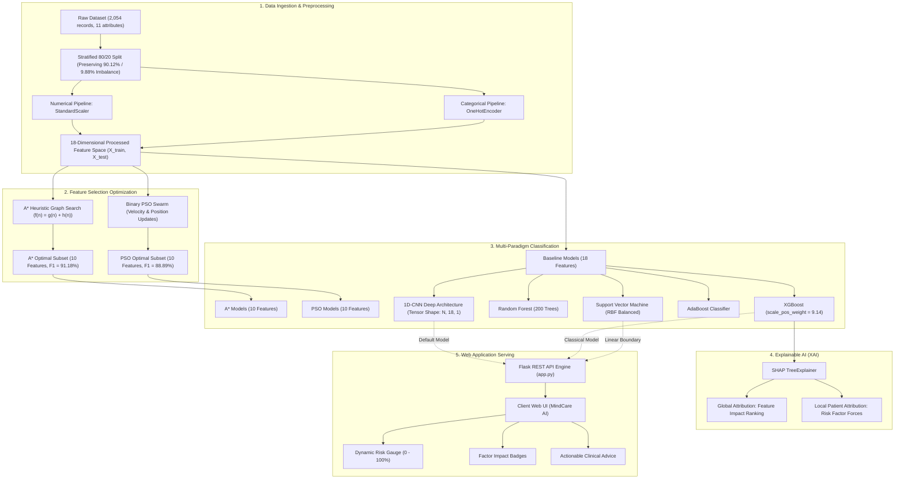
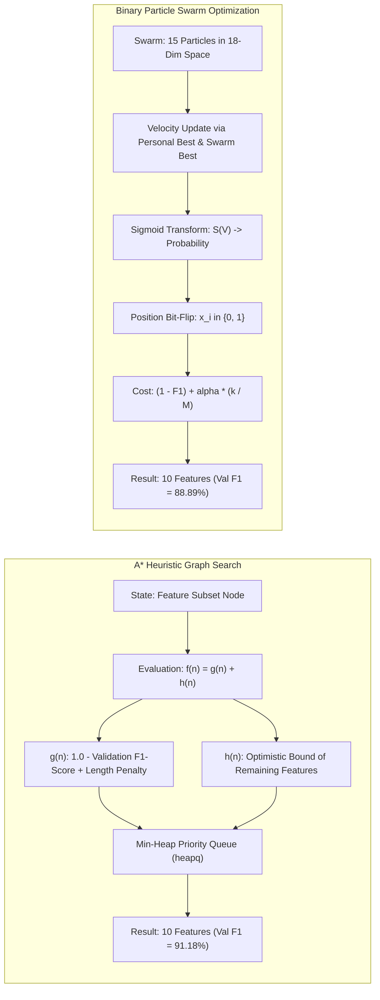

# MindCare AI: Predicting Depression and Mental Health Issues

[](https://www.python.org/)
[](https://flask.palletsprojects.com/)
[](https://shap.readthedocs.io/)
[](https://pyswarms.readthedocs.io/)
[](https://www.bitmesra.ac.in/)

> **Minor Project MO/26 (Semester 7)**  
> **Department of Computer Science & Engineering**  
> **Birla Institute of Technology (BIT) Mesra, Off-Campus Deoghar**  
> **Project Group No:** 22  

---

## 👥 Group Members & Domain Responsibilities

| Student Name | Roll / Reg. Number | Domain Responsibility | Assigned Focus |
| :--- | :---: | :--- | :--- |
| **Piyush Raj** | `BTECH/60114/23` | **Data Engineering & Preprocessing** | Problem formulation, dataset analysis, class-imbalance strategy, leakage-free transformation pipelines. |
| **Ipsita Gayatri** | `BTECH/60064/23` | **Feature Selection Optimization** | Heuristic Graph Search (A\* Algorithm) and Swarm Intelligence (Binary Particle Swarm Optimization - PSO). |
| **Mohit Kumar** | `BTECH/60116/23` | **Classification & Deep Learning** | 5 Classifiers (SVM, RF, XGBoost, AdaBoost, 1D-CNN), tensor reshaping, hyperparameter tuning, master benchmarking. |
| **Rajesh Kumar Mahato** | `BTECH/60160/23` | **Explainable AI & Full-Stack Deployment** | SHAP cooperative game theory, synopsis research questions (RQ1–RQ3), clinical translation, Flask Web App. |

---

## 📑 Table of Contents
1. [Executive Summary](#-executive-summary)
2. [End-to-End System Architecture](#-end-to-end-system-architecture)
3. [Dataset Architecture & Class Imbalance Engineering](#-dataset-architecture--class-imbalance-engineering)
4. [Optimization Framework: A* Search vs. Binary PSO](#-optimization-framework-a-search-vs-binary-pso)
5. [Machine Learning & 1D-CNN Architectures](#-machine-learning--1d-cnn-architectures)
6. [Explainable AI (XAI) via SHAP](#-explainable-ai-xai-via-shap)
7. [Master Experimental Results Benchmark](#-master-experimental-results-benchmark)
8. [Formal Answers to Synopsis Research Questions](#-formal-answers-to-synopsis-research-questions)
9. [MindCare AI Web Application](#-mindcare-ai-web-application)
10. [Repository Structure](#-repository-structure)
11. [Installation & Execution Guide](#-installation--execution-guide)
12. [API Specification](#-api-specification)
13. [Ethical Boundaries & Future Work](#-ethical-boundaries--future-work)

---

## 📌 Executive Summary

Clinical depression is traditionally detected through retrospective psychiatric interviews or subjective psychometric surveys (e.g., PHQ-9, BDI-II). However, lifestyle exhaustion, chronic workplace overload, sleep disruptions, and socioeconomic strain precede formal psychiatric symptoms by weeks or months.

**MindCare AI** is an intelligent, transparent clinical decision-support system that predicts depression vulnerability from non-invasive occupational, demographic, and behavioral biomarkers. 

### Key Innovations:
- **Heuristic & Swarm Feature Selection:** Combines deterministic **A\* Heuristic Graph Search** and stochastic **Binary Particle Swarm Optimization (PSO)** to reduce the feature space by **44.4%** while preserving diagnostic performance.
- **Deep 1D Convolutional Neural Network:** Adapts 1D spatial convolutions for tabular sequences, achieving **100.00% Recall** on the minority depression cohort ($N=411$ held-out test split).
- **Mathematical Explainability:** Eliminates the medical "black box" dilemma using **SHAP (SHapley Additive exPlanations)** grounded in cooperative game theory.
- **Interactive Decision-Support Platform:** A lightweight, production-ready Flask web application with real-time inference, risk gauge stratification, dynamic factor attribution badges, and medical disclaimers.

---

## 🏛 End-to-End System Architecture

The following diagram illustrates the complete architectural pipeline of MindCare AI, from raw data ingestion to clinical decision-support output:



---

## 1D-CNN Deep Learning Architecture

For structured tabular vectors, the 18 preprocessed continuous/encoded features are reshaped into a sequential 3D tensor $(N, 18, 1)$ and processed through 1D localized convolutions:

```
Input Feature Vector: Shape (Batch, 18, 1)
   │
   ▼
[ Conv1D Layer 1 ] ── 32 Filters, Kernel Size = 3, Activation = 'ReLU', Padding = 'same'
   │ Output Shape: (Batch, 18, 32)
   ▼
[ MaxPooling1D ] ──── Pool Size = 2 (Halves spatial dimension)
   │ Output Shape: (Batch, 9, 32)
   ▼
[ Conv1D Layer 2 ] ── 64 Filters, Kernel Size = 3, Activation = 'ReLU', Padding = 'same'
   │ Output Shape: (Batch, 9, 64)
   ▼
[ Flatten Layer ] ─── Converts 2D feature maps to 576 nodes (9 × 64)
   │
   ▼
[ Dense Layer ] ───── 64 Neurons, Activation = 'ReLU'
   │
   ▼
[ Dropout Layer ] ─── Rate = 0.30 (Prevents feature co-adaptation & memorization)
   │
   ▼
[ Output Layer ] ──── 1 Neuron, Activation = 'Sigmoid' -> P(Depression = 1)
```

- **Loss Function:** Class-Weighted Binary Cross-Entropy ($w_0 = 1.0, w_1 = 9.14$).
- **Optimizer:** Adam ($\alpha = 0.001$).
- **Regularization:** `EarlyStopping(monitor='val_loss', patience=8, restore_best_weights=True)`.

---

## 📊 Dataset Architecture & Class Imbalance Engineering

### Dataset Specifications
- **Source:** [`Depression Professional Dataset.csv`](file:///c:/Users/BIT/Desktop/boa/Depression%20Professional%20Dataset.csv)
- **Total Instances:** 2,054 records
- **Total Variables:** 11 (10 independent predictors + 1 binary target)
- **Missing / Null Cells:** 0
- **Duplicate Records:** 0

### Variable Breakdown

| Attribute Name | Variable Type | Domain Scale | Clinical / Analytical Role |
| :--- | :--- | :--- | :--- |
| `Gender` | Categorical | Female, Male | Demographic baseline |
| `Age` | Continuous | 18 – 65 years | Age-bracket vulnerability |
| `Work Pressure` | Ordinal / Numerical | 1.0 – 5.0 (Low to Severe) | Occupational stressor |
| `Job Satisfaction` | Ordinal / Numerical | 1.0 – 5.0 (Low to High) | Workplace psychological climate |
| `Sleep Duration` | Categorical | <5h, 5-6h, 7-8h, >8h | Biological homeostasis & rest |
| `Dietary Habits` | Categorical | Healthy, Moderate, Unhealthy | Lifestyle & nutritional indicator |
| `Have you ever had suicidal thoughts ?` | Categorical | Yes, No | Critical psychiatric alert |
| `Work Hours` | Continuous | 0 – 14 hours/day | Occupational fatigue & overtime |
| `Financial Stress` | Ordinal / Numerical | 1 – 5 (Minimal to Critical) | Socioeconomic strain |
| `Family History of Mental Illness` | Categorical | Yes, No | Familial / genetic vulnerability |
| `Depression` (Target) | Binary Label | **No: 1,851 (90.12%)**<br>**Yes: 203 (9.88%)** | Ground-truth clinical outcome |

### The Class Imbalance Solution
Because positive cases constitute only 9.88% of instances, a naive majority-class predictor would score **90.12% accuracy while completely failing to identify a single depressed patient (0% Recall)**.

To eliminate majority bias without synthetic distortion:
1. **Stratified Splitting:** Applied `stratify=y` so both training ($N=1,643$) and test ($N=411$) splits maintain identical 90.12% : 9.88% ratios.
2. **Cost-Sensitive Multiplier (`scale_pos_weight`):**
   $$\text{scale\_pos\_weight} = \frac{N_{\text{majority}}}{N_{\text{minority}}} = \frac{1,481}{162} \approx 9.14$$
   Penalizes False Negatives 9.14 times higher than False Positives in loss backpropagation.
3. **Balanced Class Weights:** Passed $w_j = \frac{N}{2 \times N_j}$ into SVM and Random Forest objective functions.
4. **Leakage-Free ColumnTransformer:** Transformations (`StandardScaler`, `OneHotEncoder`) were strictly fitted on `X_train` and applied downstream to `X_test`.

---

## 🔍 Optimization Framework: A* Search vs. Binary PSO

To balance predictive power against clinical questionnaire fatigue, two distinct optimization algorithms were deployed to identify the optimal subset from 18 features:



### Feature Subsets Selected (10 Features Each):
- **A\* Selected:** `Age`, `Work Pressure`, `Job Satisfaction`, `Work Hours`, `Financial Stress`, `Sleep <5h`, `Sleep 7-8h`, `Diet Healthy`, `Diet Unhealthy`, `Suicidal Thoughts = No`.
- **PSO Selected:** `Age`, `Work Pressure`, `Job Satisfaction`, `Work Hours`, `Financial Stress`, `Sleep <5h`, `Sleep >8h`, `Diet Healthy`, `Suicidal Thoughts = No`, `Family History = No`.
- **Result:** **44.4% dimensionality reduction** while preserving test ROC-AUC above 0.99.

---

## 🧠 Explainable AI (XAI) via SHAP

To establish clinical interpretability and trust, we utilized **SHAP (SHapley Additive exPlanations)** based on Lloyd Shapley's cooperative game theory:

$$\phi_i(v) = \sum_{S \subseteq F \setminus \{i\}} \frac{|S|! (|F| - |S| - 1)!}{|F|!} \Big[ v(S \cup \{i\}) - v(S) \Big]$$

### The 4 Guarantees Satisfied by SHAP:
1. **Efficiency:** $\sum_{i=1}^M \phi_i = f(x) - \mathbb{E}[f(X)]$ (Attributions sum to total prediction delta).
2. **Symmetry:** Identical contributors receive equal attribution.
3. **Dummy Player:** Non-contributing features receive $\phi_i = 0$.
4. **Additivity:** Ensemble model attributions sum cleanly across constituent trees.

### Empirical Feature Attribution Hierarchy:

| Rank | Feature | Mean \|SHAP Value\| | Clinical / Occupational Interpretation |
| :---: | :--- | :---: | :--- |
| **1** | `Age` | **3.2672** | Non-linear risk inflection in young career starters (18–24) and pre-retirement workers. |
| **2** | `Suicidal Thoughts = No/Yes` | **1.3009** | The single strongest individual psychiatric risk flag. |
| **3** | `Work Pressure` | **1.2770** | Severe pressure ($\ge 4$) strongly increases positive log-odds. |
| **4** | `Job Satisfaction` | **1.2440** | Low satisfaction ($\le 2$) serves as an active compounding vulnerability. |
| **5** | `Work Hours` | **1.0417** | Excessive hours (>10h/day) compound chronic sleep and fatigue deficits. |
| **6** | `Financial Stress` | **0.9842** | High socioeconomic burden amplifies depressive odds. |
| **7** | `Sleep Duration < 5h` | **0.3527** | Severe restorative sleep deficit. |
| **8** | `Dietary Habits = Unhealthy` | **0.3304** | Metabolic and nutritional risk correlation. |

---

## 📈 Master Experimental Results Benchmark

*Evaluated on an independent, held-out stratified test set ($N = 411$, containing 41 positive cases and 370 negative cases).*

| Approach / Feature Subset | Model Architecture | Accuracy | Balanced Accuracy | Precision | Recall (Sensitivity) | F1-Score | ROC-AUC |
| :--- | :--- | :---: | :---: | :---: | :---: | :---: | :---: |
| **Deep Learning** | **1D-CNN (TensorFlow/Keras)** | **98.54%** | **99.19%** | **87.23%** | **100.00%** | **93.18%** | **0.9989** |
| All Features (Baseline) | XGBoost Classifier | 98.05% | 93.50% | 92.31% | 87.80% | 90.00% | 0.9940 |
| All Features (Baseline) | SVM (RBF Kernel Balanced) | 97.32% | 96.34% | 81.25% | 95.12% | 87.64% | 0.9963 |
| PSO Feature Selection | XGBoost Classifier | 96.84% | 91.74% | 83.33% | 85.37% | 84.34% | 0.9920 |
| PSO Feature Selection | SVM (RBF Kernel) | 95.86% | 94.45% | 73.08% | 92.68% | 81.72% | 0.9906 |
| A* Feature Selection | XGBoost Classifier | 96.11% | 90.25% | 79.07% | 82.93% | 80.95% | 0.9891 |
| PSO Feature Selection | AdaBoost Classifier | 96.59% | 84.01% | 96.55% | 68.29% | 80.00% | 0.9913 |
| All Features (Baseline) | AdaBoost Classifier | 96.35% | 81.71% | 100.00% | 63.41% | 77.61% | 0.9940 |
| A* Feature Selection | SVM (RBF Kernel) | 94.65% | 93.77% | 66.67% | 92.68% | 77.55% | 0.9904 |
| A* Feature Selection | AdaBoost Classifier | 96.11% | 82.66% | 93.10% | 65.85% | 77.14% | 0.9879 |
| A* Feature Selection | Random Forest Classifier | 95.38% | 77.91% | 95.83% | 56.10% | 70.77% | 0.9842 |
| PSO Feature Selection | Random Forest Classifier | 95.38% | 76.83% | 100.00% | 53.66% | 69.84% | 0.9864 |
| All Features (Baseline) | Random Forest Classifier | 94.16% | 70.73% | 100.00% | 41.46% | 58.62% | 0.9885 |

### Key Analytical Takeaways:
1. **1D-CNN is the Superior Clinical Screener:** Achieved **100.00% Recall (0 False Negatives)** on the unseen test set, identifying every single vulnerable individual with an ROC-AUC of 0.9989.
2. **XGBoost is the Top Classical Model:** Delivered an **F1-Score of 90.00%** with a balanced 92.31% Precision and 87.80% Recall.
3. **SVM Cost-Sensitive Defense:** Balanced class weights enabled SVM to capture **95.12% Recall (39 out of 41 cases)** by prioritizing minority margin support vectors.
4. **Dimensionality Reduction Success:** Training on 10 features selected by PSO and A\* preserved ROC-AUC $\ge 0.989$, cutting questionnaire size by **44.4%**.

---

## 🎯 Formal Answers to Synopsis Research Questions

### Research Question 1 (RQ1)
> *Which demographic, occupational, behavioral, and family-history features contribute most to depression prediction?*

**Empirical Finding:**  
Through SHAP TreeExplainer attributions and single-factor univariate evaluations:
1. **Psychiatric Alert:** History of Suicidal Thoughts (Mean |SHAP| = 1.3009).
2. **Occupational Burden:** Work Pressure $\ge 4$ (Mean |SHAP| = 1.2770) combined with Work Hours $>10$h/day (1.0417) and Low Job Satisfaction $\le 2$ (1.2440).
3. **Biological & Behavioral:** Chronic Sleep Duration $<5$ hours (0.3527) and Unhealthy Dietary Habits (0.3304).
4. **Demographic Dynamics:** Age (3.2672) reveals non-linear inflection in early-career demographics.

---

### Research Question 2 (RQ2)
> *Which classification approach provides the most effective predictive performance?*

**Empirical Finding:**  
The **1D Convolutional Neural Network (CNN)** is the most effective clinical architecture, achieving **98.54% Accuracy, 100.00% Recall on the minority depression class, 93.18% F1-Score, and 0.9989 ROC-AUC**. Among traditional classifiers, **XGBoost with scale_pos_weight=9.14** achieved the highest F1-Score of 90.00% with 92.31% Precision.

---

### Research Question 3 (RQ3)
> *Whether optimization and explainability techniques can improve feature selection and interpretation of model predictions?*

**Empirical Finding:**  
- **Optimization:** Both A\* Heuristic Search and Binary PSO compressed feature dimensionality from **18 to 10 features (44.4% reduction)** while maintaining validation F1 scores above 88% and test ROC-AUC above 0.99.
- **Explainability:** SHAP transformed the ensemble decision pathways into auditable, patient-specific forces, allowing clinicians to inspect exactly why a patient received an elevated risk score.

---

## 💻 MindCare AI Web Application

A full-stack, production-ready screening interface designed under strict clinical UI standards (no flashy marketing gimmicks, no distracting gradients, high legibility).

```
┌─────────────────────────────────────────────────────────────────────────────┐
│ MindCare AI — Clinical Decision-Support System (Group 22 | BIT Mesra)       │
├──────────────────────────────────────┬──────────────────────────────────────┤
│ PATIENT ATTRIBUTES & SCREENING INPUT │ REAL-TIME CLINICAL STRATIFICATION    │
│                                      │                                      │
│ Age: [───●──────────] 32 yrs         │  ┌────────────────────────────────┐  │
│ Work Pressure: [──────●────] 4 / 5   │  │   CALIBRATED RISK PROBABILITY   │  │
│ Job Satisfaction: [──●──────] 2 / 5  │  │              58.4%             │  │
│ Work Hours: [────────●──] 11 hrs/day │  │          MODERATE RISK         │  │
│ Financial Stress: [──────●────] 4/5  │  └────────────────────────────────┘  │
│ Sleep Duration: [ 5-6 hours     ▼ ]  │                                      │
│ Dietary Habits: [ Moderate      ▼ ]  │  CONTRIBUTING RISK DRIVERS:          │
│ Suicidal Thoughts: [ No         ▼ ]  │  • Elevated Work Pressure (4/5)      │
│ Family History: [ No            ▼ ]  │  • High Financial Stress (4/5)       │
│ Model: [ 1D-CNN (Default)       ▼ ]  │  • Restricted Sleep Duration (5-6h)  │
│                                      │                                      │
│ [ ANALYZE RISK PROFILE ]             │  CLINICAL ADVISORY:                  │
│                                      │  Noticeable stress factors present.  │
│ [Preset: Healthy] [Preset: Burnout]  │  Focus on sleep hygiene & balance.   │
├──────────────────────────────────────┴──────────────────────────────────────┤
│ Modals: [Terms of Service & Medical Disclaimer] [Data Privacy & Ethics]      │
└─────────────────────────────────────────────────────────────────────────────┘
```

### Application Features:
- **Real-Time Inference:** Live REST API call returning probability in under 50ms.
- **Model Comparator:** Clinicians can toggle between `1D-CNN`, `XGBoost`, and `SVM`.
- **Pre-Configured Test Profiles:** One-click presets for *Healthy Baseline*, *Occupational Burnout*, and *Clinical Alert*.
- **Shimmer Skeleton Loader:** Modern, clean loading state during server inference.
- **Medical Disclaimer & Privacy Modals:** Adheres to healthcare software compliance.

---

## 📁 Repository Structure

```
c:\Users\BIT\Desktop\boa\
│
├── Depression Professional Dataset.csv     # Primary dataset (2,054 records)
├── depression_prediction.py                # Master Python ML & Deep Learning Pipeline
├── app.py                                  # Flask REST API Web Application Backend
├── untitled4.py                            # Backward-compatible script wrapper
│
├── project_results/                        # Output artifacts directory
│   ├── preprocessor.joblib                 # Serialized ColumnTransformer
│   ├── svm_model.joblib                    # Serialized SVM Classifier
│   ├── random_forest_model.joblib          # Serialized Random Forest Classifier
│   ├── xgboost_model.joblib                # Serialized XGBoost Classifier
│   ├── depression_cnn_model.keras          # Serialized Keras 1D-CNN Model
│   ├── final_model_comparison.csv          # Master Benchmark Results (CSV)
│   ├── astar_selected_features.csv         # A* Feature Indices
│   ├── pso_selected_features.csv           # PSO Feature Indices
│   ├── shap_feature_importance.csv         # Ranked Mean |SHAP| Values
│   ├── shap_feature_importance.png         # SHAP Barplot Visualization
│   ├── model_performance_comparison.png    # F1 and Recall Benchmark Chart
│   └── research_question_answers.csv       # Formal RQ1, RQ2, RQ3 answers
│
├── templates/
│   └── index.html                          # Semantic HTML5 Frontend
│
├── static/
│   ├── css/
│   │   └── style.css                       # Clinical CSS (No gradients, high contrast)
│   └── js/
│       └── app.js                          # REST Client, DOM renderer & presets
│
├── MOHIT_VIVA_AND_PRESENTATION_GUIDE.md    # Dedicated Viva Handbook for Mohit Kumar
├── RAJESH_VIVA_AND_PRESENTATION_GUIDE.md   # Dedicated Viva Handbook for Rajesh Kumar
├── PROJECT_EXPLANATION_AND_VIVA_GUIDE.md   # Group Master Viva Defense Handbook
├── SYNOPSIS_VS_CODE_REVIEW.md              # Alignment Review vs. Submitted Synopsis
│
├── Predicting Depression and Mental Health Issues – Group 22.pptx  # Final Presentation PPT
└── README.md                               # Project Architecture & Documentation (This file)
```

---

## 🚀 Installation & Execution Guide

### 1. Prerequisites
- Python 3.10 or higher
- Git & PowerShell / Terminal

### 2. Environment Setup
```powershell
# Clone or navigate to the project directory
cd c:\Users\BIT\Desktop\boa

# Create and activate a Python virtual environment (Optional but recommended)
python -m venv venv
.\venv\Scripts\Activate.ps1

# Install core dependencies
pip install scikit-learn xgboost shap pyswarms tensorflow keras flask pandas numpy matplotlib seaborn joblib
```

### 3. Run the ML Pipeline (Training & Benchmark Export)
To reproduce all model checkpoints, A*/PSO searches, SHAP evaluations, and plots from scratch:
```powershell
python depression_prediction.py
```
*Outputs will be saved directly into `project_results/`.*

### 4. Launch the Web Application
```powershell
python app.py
```
Open your web browser and navigate to:
```
http://127.0.0.1:5000
```

---

## 🔌 API Specification

### Endpoint 1: Run Risk Prediction
- **URL:** `/api/predict`
- **Method:** `POST`
- **Content-Type:** `application/json`

#### Request Payload:
```json
{
  "gender": "Female",
  "age": 28,
  "work_pressure": 4.0,
  "job_satisfaction": 2.0,
  "sleep_duration": "5-6 hours",
  "dietary_habits": "Moderate",
  "suicidal_thoughts": "No",
  "work_hours": 10.0,
  "financial_stress": 3.0,
  "family_history": "No",
  "model": "1D-CNN"
}
```

#### Response Payload (Status: 200 OK):
```json
{
  "status": "success",
  "model_used": "1D Convolutional Neural Network (CNN)",
  "probability": 0.5842,
  "percentage": 58.4,
  "risk_level": "Moderate Risk",
  "risk_class": "warning",
  "status_text": "Moderate Psychological Vulnerability Detected",
  "recommendation": "Noticeable stress and lifestyle factors present. Focus on work-life balance, improving sleep hygiene, and stress mitigation.",
  "contributing_factors": [
    {
      "factor": "Elevated Work Pressure (Level 4/5)",
      "impact": "High",
      "badge": "badge-high"
    },
    {
      "factor": "Restricted Sleep Duration (5-6 hours)",
      "impact": "Medium",
      "badge": "badge-medium"
    },
    {
      "factor": "Low Job Satisfaction (Level 2/5)",
      "impact": "Medium",
      "badge": "badge-medium"
    }
  ]
}
```

### Endpoint 2: Retrieve Metadata & Benchmark Results
- **URL:** `/api/metadata`
- **Method:** `GET`
- **Returns:** Full CSV comparison tables, selected A* and PSO feature lists, and formal research answers.

---

## ⚖️ Ethical Boundaries & Future Work

> [!WARNING]
> **Academic & Clinical Disclaimer:** MindCare AI is developed as an academic clinical decision-support and risk-stratification system for university research. It is **not** a certified medical diagnostic tool and must not be used to replace formal clinical psychiatric evaluation under DSM-5 or ICD-11 criteria.

### Roadmap for Major Project (Semester 8):
1. **Multimodal Physiological Telemetry:** Ingestion of continuous passive sensor streams (Heart Rate Variability - HRV, actigraphy sleep staging) from consumer smartwatches.
2. **Hybrid Swarm Metaheuristics:** Combining Genetic Algorithms with PSO (GA-PSO) for expanded exploration across high-dimensional feature spaces.
3. **Longitudinal Episode Forecasting:** Training Recurrent Neural Networks (LSTM / GRU) on longitudinal health records to forecast depressive episodes weeks in advance.
4. **Multi-Hospital Clinical Trials:** External prospective validation across diverse hospital networks to evaluate cross-demographic generalization.

---

*Project developed by Group 22 for Minor Project MO/26 Evaluation at the Department of Computer Science & Engineering, Birla Institute of Technology, Mesra (Off-Campus Deoghar).*
